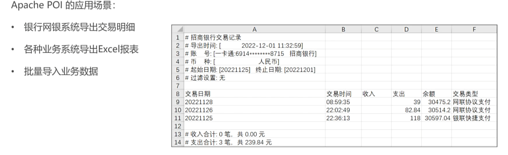
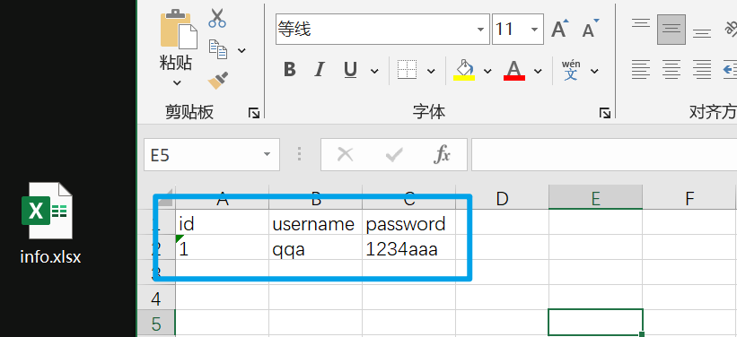
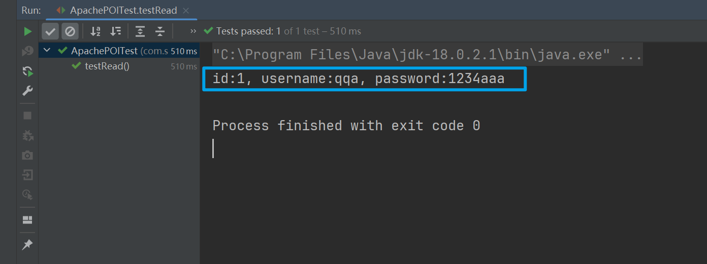

# Apache POI

> Apache POI是一个用Java编写的免费开源的跨平台Java API，全称“Poor Obfuscation  Implementation”，意为“简洁版的模糊实现”。Apache  POI提供了一套丰富的API给Java程序，使其能够读写Microsoft  Office格式的文件，包括但不限于Excel（.xls和.xlsx）、Word（.doc和.docx）、PowerPoint（.ppt和.pptx）等

Apache POI提供了一系列IO接口，来让用户操作文档：

- 写：通过写操作，可以将数据写入Mircrosoft文件中，例如Excel
- 读：通过读操作，可以将需要信息通过共享的形式让用户录入Excel表格中，之后通过Apache POI读取数据，将数据转换成为对象之后，存储到数据库当中

常见的应用场景：

- 银行系统导出交易明细

- 业务系统导出Excel报表

- 批量导入业务数据




maven项目通过maven坐标导入Apache POI依赖，从而在项目中使用Apache POI：

```xml
<!--for xls(03)-->
<dependency>
    <groupId>org.apache.poi</groupId>
    <artifactId>poi</artifactId>
    <version>3.9</version>
</dependency>
<!--for xlsx(07)-->
<dependency>
    <groupId>org.apache.poi</groupId>
    <artifactId>poi-ooxml</artifactId>
    <version>3.9</version>
</dependency>
```

## Excel IO

### 写单元格

Apache POI操作Excel文件代码具有良好的可读性，其API根据手写Excel文件的体验设计

Excel文件具有如下格式：

- Excel当中会包含若干**行列**，它们被分布在一个**sheet**中
- 一份Excel文档中可以创建多个**sheet**
- 用户对某一张sheet中的**单元格**进行具体的操作

Apache POI的写操作类似这样的过程，示例代码如下：

```java
@Test
public void testWrite() throws Exception{
    XSSFWorkbook excel = new XSSFWorkbook();  // 创建excel
    XSSFSheet sheet1 = excel.createSheet("sheet1");  // 创建sheet，命名为sheet1
    
    XSSFRow row = sheet1.createRow(0);  // 创建第一行，注意第一行索引为0
    row.createCell(0).setCellValue("id");
    row.createCell(1).setCellValue("username");
    row.createCell(2).setCellValue("password");

    row = sheet1.createRow(1);  // 创建第二行，并且往三个单元格插入数据
    row.createCell(0).setCellValue("1");
    row.createCell(1).setCellValue("qqa");
    row.createCell(2).setCellValue("1234aaa");

    // 导出文件
    FileOutputStream fos = new FileOutputStream("D:\\desktop\\info.xlsx");  
    excel.write(fos);
    
    excel.close();  // 关闭资源
    fos.close();
}
```

通过文件输出流会在桌面下自动生成excel文件，效果如下：



在写操作中，我们遵循下面的流程：

1. 创建一个excel文件对象
2. 通过对象创建一个row，接着创建一个cell
3. 然后就能够对单元格cell进行操作了

### 读单元格

Apache POI读操作，通过文件输入流，将Excel文件读取进入Apache POI的excel表格对象中，示例代码如下：

```java
@Test
public void testRead() throws Exception {
    // 创建一个文件输入流，用于读取excel文件
    FileInputStream fis = new FileInputStream("D:\\desktop\\info.xlsx");
    // 创建excel操作对象，使用前面的文件输入流来初始化它
    XSSFWorkbook excel = new XSSFWorkbook(fis);
    XSSFSheet sheet = excel.getSheet("sheet1");

    // 通过getLastRow方法可以获取存在内容的最后一行的行号
    int last = sheet.getLastRowNum(); // 这里获取的是索引，所以应该是1

    // for循环直接从1开始，因为第一行为表头
    for (int i = 1; i <= last; i++) {
        // 通过for循环遍历输出
        XSSFRow row = sheet.getRow(i);
        XSSFCell id = row.getCell(0);
        XSSFCell username = row.getCell(1);
        XSSFCell password = row.getCell(2);

        System.out.println("id:" + id + ", username:" + username + ", password:" + password);
    }

    // 关闭资源
    excel.close();
    fis.close();
}
```

遍历通过sheet对象的getLastRow方法获取最大行索引，然后进行遍历，执行结果：

